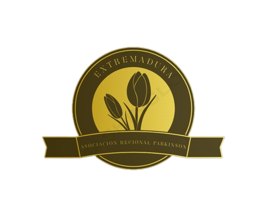

  

## Project Description 🚀

SoundTracks Magics is a highly functional and secure audio playback web platform. We employ the Agile methodology to ensure swift adaptation to the project's changing needs. This platform will allow users to access and enjoy a wide variety of audio content, including music, movie soundtracks, series, and more, with a focus on security and user experience.

## Screenshots Desktop 💻

## Screenshots Responsive Mobile 📱

&nbsp;&nbsp;&nbsp;&nbsp;&nbsp;&nbsp;&nbsp;&nbsp;&nbsp;&nbsp;&nbsp;&nbsp;&nbsp;&nbsp;&nbsp;&nbsp;&nbsp;&nbsp;&nbsp;&nbsp;&nbsp;&nbsp;&nbsp;&nbsp;&nbsp;&nbsp;&nbsp;&nbsp;&nbsp;&nbsp;&nbsp;&nbsp;&nbsp;&nbsp;&nbsp;&nbsp;&nbsp;&nbsp;&nbsp;&nbsp;&nbsp;&nbsp;

## Stacks 🖥️
● Visual Studio Code  
● React  
● Frameworks  
● Bootstrap  
● Material UI  
● JavaScript  
● CSS  
● HTML  
● Cloudinary  
● GitHub  
● Trello  
● Figma  
● Slack  
● Zoom

## Libraries 📚

## Technologies and Tools 🔨

  
  
  
  
  
  
  
  
  
   

## Tech Stack 🛠️

## Methodology 📚

● Mob, pair and solo programming  
● Agile with Scrum & Trello  
● Testing  
● We work with branches: 7 working branches were used on GitHub to manage the workflow:  
- Main: This branch contains functional and stable code. It is the main and/or final branch.  
- Dev: It's the branch where different working codes are integrated into one and where preliminary testing is done before production. It's an intermediate and/or safety branch.  
- Independents: These are different branches where each team member develops their code according to assigned tasks for later merging into the Dev branch. It's an independent and/or testing branch.  
+ The branch methodology allows us to work collaboratively and maintain an organized and efficient workflow. Furthermore, working in branches allows us to work freely without conflicting with the work of other team members. Additionally, it provides us with greater control and a record or history of the various changes being made. On the other hand, for added security when merging codes from different branches, we have implemented security rules on GitHub where it is necessary to create a pull request prior to the merge.

## Tests ☑️

## Test Screenshot ✔️
 Once the component installations are complete, in a new terminal, run **npm test**.

## Installation Process ⬆️

1. Clone the GitHub repository: https://github.com/isabellozano37/music-projet
2. Open the file using Visual Studio Code.
3. Open the terminal in Visual Studio Code.
4. Install the following command: **npm i.**
5. Once the component installations are complete, in a new terminal, run **npm run dev**. Open the **localhost**: that appears.

## Next Steps 🔜
Once linked to the Back-End project (https://github.com/isabellozano37/MusicProject-BackEnd), we will continue to improve both the functional part of the database and the visual part in the Front-End with the aim of providing a greater and better user experience. In our Front-End repository, we will continue to add new music categories where users can enjoy more musical content, expanding beyond the usual Soundtracks already included in the current repository, extending to other fields such as TV series, musicals, etc. Similarly, in the current categories, we will continue to include a greater number of Soundtracks, in order to complete this website as much as possible.

## Authors 👨‍💻👩‍💻

| [ Isabel Lozano](https://github.com/isabellozano37) | [ Rodrigo Muñoz](https://github.com/Rodrialemu) | [ Ángel Serrano](https://github.com/angelserranocorrea) | [ Laura Barrero](https://github.com/laurabarrerogonzalez) | [ Miguel Cidoncha](https://github.com/miguelcidoncha) | [ Christian Jaiki](https://github.com/ChristianJaiki12) |
| :---: | :---: | :---: | :---: | :---: | :---: |

