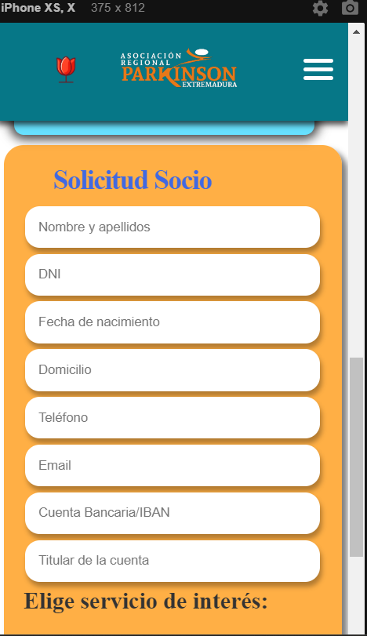

  

## Project Description 🚀

This educational project has the ambitious goal of establishing an informative blog dedicated to the Parkinson Extremadura Regional Association. From the ground up, in our ongoing quest to make a positive impact on the lives of those facing Parkinson's, we are delighted to introduce the digital platform of the "Parkinson Extremadura Regional Association." With a patient-centered focus, our website provides an informative, inclusive, and supportive experience for everyone.

Explore and Discover:
- Latest News: Stay updated with the latest developments and breakthroughs related to Parkinson's, offering a reliable source of information for patients, families, and healthcare professionals.
- Become a Member or Volunteer: Join our dedicated community to make a difference in the lives of those living with Parkinson's. Discover how you can contribute and be part of meaningful initiatives.
- Work With Us: Explore employment and volunteer opportunities, contributing to the growth and success of our association. Your dedication and skills can make a difference.
- Services: Obtain detailed information about the services we offer, designed to improve the quality of life for those affected by Parkinson's. From emotional support programs to physiotherapy services, we are committed to providing comprehensive support.
- Who We Are: Learn more about our mission, vision, and the values that drive us. Discover the history of the association and the team working tirelessly to address Parkinson's in the Extremadura region.
- What is Parkinson's?: Gain educational and comprehensive information about Parkinson's disease. Understanding the medical and emotional aspects is crucial for addressing the challenges faced by patients and their loved ones.
- Donations: Support our cause through donations. Each contribution brings us a step closer to offering enhanced services and advancing research to find effective solutions.
- Locations: Find our presence in different areas of Extremadura, including Mérida, Cáceres, Badajoz, and Montijo. We are committed to being accessible to those who need our support.

Our mission is to provide an accessible and useful platform for those affected by Parkinson's and their families. We are dedicated to sharing valuable information, resources, and support, thus creating an informed and supportive community around this disease. Welcome to our online community!

## Screenshots Desktop 💻

## Screenshots Responsive Mobile  📱

&nbsp;&nbsp;&nbsp;&nbsp;&nbsp;&nbsp;&nbsp;&nbsp;&nbsp;&nbsp;&nbsp;&nbsp;&nbsp;&nbsp;&nbsp;&nbsp;&nbsp;&nbsp;&nbsp;&nbsp;&nbsp;&nbsp;&nbsp;&nbsp;&nbsp;&nbsp;&nbsp;&nbsp;&nbsp;&nbsp;

## Stacks 🖥️
● Visual Studio Code  
● React  
● Frameworks  
● Bootstrap  
● JavaScript  
● CSS  
● HTML  
● Cloudinary  
● GitHub  
● Trello  
● Figma  
● Slack  
● Zoom

## Libraries 📚

## Technologies and Tools 🔨

  
  
  
  
  
  
  
  
  
   

## Tech Stack 🛠️

## Methodology 📚

● Mob, pair and solo programming  
● Agile with Scrum & Trello  
● Testing  
● We work with branches: 8 working branches were used on GitHub to manage the workflow:  
- Main: This branch contains functional and stable code. It is the main and/or final branch.  
- Dev: It's the branch where different working codes are integrated into one and where preliminary testing is done before production. It's an intermediate and/or safety branch.  
- Independents: These are different branches where each team member develops their code according to assigned tasks for later merging into the Dev branch. It's an independent and/or testing branch.  
+ The branch methodology allows us to work collaboratively and maintain an organized and efficient workflow. Furthermore, working in branches allows us to work freely without conflicting with the work of other team members. Additionally, it provides us with greater control and a record or history of the various changes being made. On the other hand, for added security when merging codes from different branches, we have implemented security rules on GitHub where it is necessary to create a pull request prior to the merge.

## Tests ☑️

## Test Screenshot ✔️
 Once the component installations are complete, in a new terminal, run **npm test**.  

## Installation Process ⬆️

1. Clone the GitHub repository: https://github.com/laurabarrerogonzalez/parkinsonasociacion
2. Open the file using Visual Studio Code.
3. Open the terminal in Visual Studio Code.
4. Install the following command: **npm i.**
5. Once the component installations are complete, in a new terminal, run **npm run dev**. Open the **localhost**: that appears.

## Next Steps (Coming soon) 🔜

## Authors 👨‍💻👩‍💻

| [ Isabel Lozano](https://github.com/isabellozano37) | [ Rodrigo Muñoz](https://github.com/Rodrialemu) | [ Ángel Serrano](https://github.com/angelserranocorrea) | [ Laura Barrero](https://github.com/laurabarrerogonzalez) | [ Miguel Cidoncha](https://github.com/miguelcidoncha) | [ Christian Jaiki](https://github.com/ChristianJaiki12) |
| :---: | :---: | :---: | :---: | :---: | :---: |

